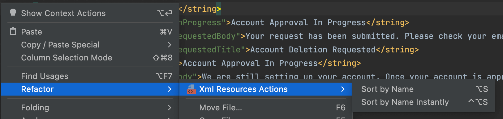
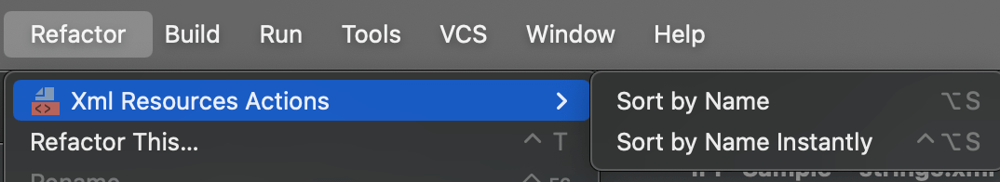

# xml-resources-sorter

An IntelliJ & Android Studio plugin to sort xml files who have "resources" element, in which items have the "name"
attribute.

Common case is strings.xml/color.xml/style.xml in Android project.

## Supported file format

Any xml file who matches below formats

```
<?xml version="1.0" encoding="utf-8" standalone="no"?>
...
    <resources>
        ...
        <color name="black">#FF000000</color>
        ...
    </resources>
...
```

## Visual Effect




## Keyboard shortcut

- Option + [Shift] + S(macOS)

